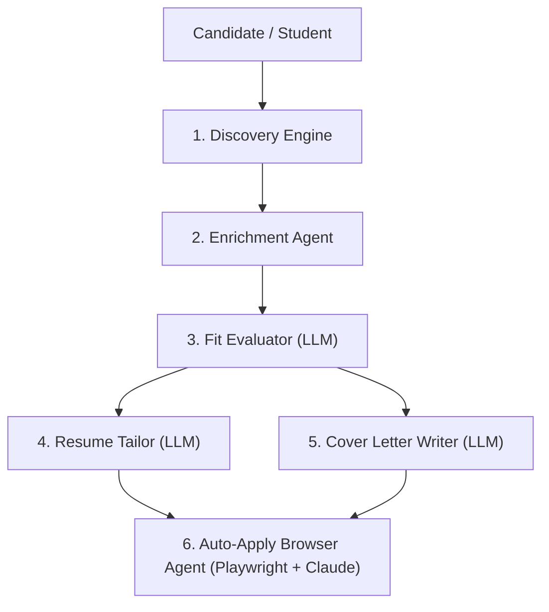

# AGENTS.md — Autonomous Agent Architecture in ApplyPilot

ApplyPilot is powered by a multi-agent autonomous system designed to handle job discovery, detail extraction, candidate-job fit scoring, resume tailoring, cover letter generation, and browser-driven application submission.

---

## 🤖 Multi-Agent Architecture



---

## 1. Discovery Engine & Scraper Agents

The Discovery Engine scans multiple job boards, corporate portals, and direct career sites concurrently:

### 1.1 JobSpy Scraper
- **Target Platforms**: Naukri India, LinkedIn India, Indeed India (`in.indeed.com`), Glassdoor India, Google Jobs.
- **Location Engine**: Filters jobs across Indian tech hubs (Bengaluru, Hyderabad, Pune, Gurugram, Noida, Mumbai, Chennai, Remote India).
- **Default Country**: Configured to `country: "india"` and `country_indeed: "india"`.

### 1.2 Playwright SmartExtract Agent (`smartextract.py`)
Uses headless Chromium (`sync_playwright`) to render JavaScript-heavy sites, capture JSON-LD metadata, and bypass anti-bot API restrictions.
- **Indian Target Platforms**:
  - **Naukri India**: `https://www.naukri.com`
  - **Instahyre**: `https://www.instahyre.com`
  - **Unstop (Dare2Compete)**: `https://unstop.com` (College challenges & off-campus hiring)
  - **Hirist**: `https://www.hirist.tech`
  - **Cutshort**: `https://cutshort.io`
  - **Foundit India**: `https://www.foundit.in`
  - **Wellfound India**: `https://wellfound.com/role/l/software-engineer/india`
  - **Internshala Freshers**: `https://internshala.com`

### 1.3 Workday API Agent (`workday.py`)
Scrapes Workday CXS JSON endpoints directly across Global Capability Centers (GCCs) and IT MNCs operating in India (Amazon India, Walmart Global Tech India, Target India, Cisco India, Wipro, Cognizant, Capgemini India).

---

## 2. Enrichment Agent (`detail.py`)

Visits discovered job URLs to retrieve full descriptions, requirements, and direct apply links using a 3-tier cascade:
1. **Structured JSON-LD**: Extracts `JobPosting` schema directly from HTML `<script>` tags.
2. **CSS Selectors**: Uses preconfigured DOM selector rules.
3. **LLM Extraction**: Falls back to LLM extraction for unknown page layouts.

---

## 3. Fit Evaluator Agent (`scorer.py`)

- Rates candidate-job alignment on a scale of **1 to 10**.
- Compares candidate's skills, experience, and education against the job description.
- Filters out jobs below the minimum score threshold (default: `7`).

---

## 4. Resume Tailor Agent (`tailor.py`)

- Rewrites and reorganizes candidate experience to emphasize relevant keywords and requirements.
- Strictly preserves candidate's `resume_facts` (real companies, metrics, school names, dates). **Never fabricates facts.**
- Validates tailored outputs against banned buzzwords and schema constraints.

---

## 5. Cover Letter Writer Agent (`cover_letter.py`)

- Generates personalized cover letters addressing the specific role, company, and team.
- Highlights candidate's relevant projects, stack match, and enthusiasm.

---

## 6. Auto-Apply Browser Agent (`apply/agent.py` & `apply/chrome.py`)

- Powered by **Playwright MCP Server** + **Claude Code / LLM agent**.
- Controls a headless or headful Chrome browser instance.
- Navigates form steps, uploads tailored resumes and cover letters, fills candidate information, and answers screening questions.

### 🇮🇳 Indian HR & Screening Question Adaptations
Recognizes and automatically fills fields specific to Indian job forms:
- **Notice Period**: `Immediate` / `Fresher` / candidate default.
- **CTC in LPA (Lakhs Per Annum)**: Answers current CTC (`0 LPA` for students) and expected CTC in INR.
- **Graduation Year & CGPA**: Fills degree details (B.Tech, B.E., M.Tech, MCA) and academic scores.
- **Relocation**: Answers relocation willingness for Indian tech hubs (Bengaluru, Hyderabad, Pune, NCR).

---

## 🛠 Usage & CLI Commands

```bash
applypilot init         # Interactive setup (defaults to India & Indian Tech Hubs)
applypilot doctor       # Diagnostics check
applypilot run          # Runs discovery -> enrich -> score -> tailor -> cover -> pdf
applypilot apply        # Autonomous browser application submission
applypilot dashboard    # Opens HTML results dashboard
```
