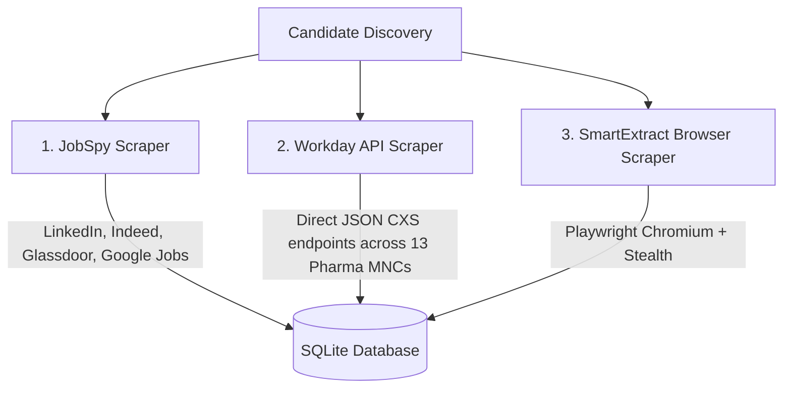

# 🕵️ Discovery Cascade & Stealth Architecture (`docs/architecture/SCRAPING_AND_STEALTH.md`)

ApplyPilot uses a 3-tier cascade for high-throughput, anti-bot resilient job discovery:

---

## 1. Discovery Cascade

1. **JobSpy Engine** (`src/applypilot/discovery/jobspy.py`):
   - Multi-worker parallel thread pool (`ThreadPoolExecutor`).
   - Scrapes LinkedIn India, Indeed India, Glassdoor India, and Google Jobs concurrently.
   - Automatically skips raw HTTP API retries on Naukri 406 CAPTCHA blocks.
2. **Workday Direct API Engine** (`src/applypilot/discovery/workday.py`):
   - Direct HTTP calls to Workday CXS JSON API endpoints across global MNCs.
   - Zero browser overhead, zero LLM cost, instant execution.
3. **SmartExtract Browser Engine** (`src/applypilot/discovery/smartextract.py`):
   - Playwright Chromium with browser stealth.
   - Extracts JSON-LD schema (`JobPosting`) and DOM elements from JS-heavy sites (Naukri Pharmacy, Pharmatutor, Unstop).

---

## 2. Chrome Header Stealth & Anti-Bot Protection (`src/applypilot/utils/stealth.py`)

- **Chrome 122 Headers**: Injects exact modern browser HTTP headers (`Sec-Ch-Ua`, `User-Agent`, `Sec-Fetch-Site`, `Sec-Fetch-Mode`).
- **Playwright Stealth Scripts**: Overrides `navigator.webdriver`, `navigator.languages`, `navigator.plugins`, and WebGL vendor strings.
- **CapSolver Hook**: `solve_recaptcha_via_capsolver()` provides optional automated CAPTCHA solving if `CAPSOLVER_API_KEY` is configured in `.env`.
